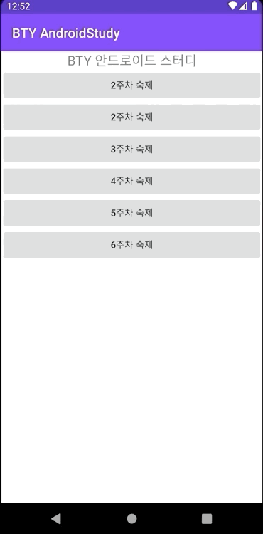

# 2주차 숙제 : 숙제 목록 화면 만들기

앞으로 숙제를 구현하기 위한 기본 앱을 만드는 것이 이번 숙제입니다.

## 요구사항

- 최상단에 제목은 TextView 로 **BTY 안드로이드 스터디** 라고 표시합니다.
- 제목의 텍스트 크기는 `16sp` 입니다.
- 그 아래 버튼을 5개(2주차 ~ 6주차) 구현합니다. 버튼은 각각 `n주차 숙제`라고 표시합니다
- 2주차 숙제버튼을 누르면 `AlertDialog`를 출력합니다. 
- 다이얼로그는 숙제에 대한 설명("2주차 숙제는 화면전환 예제를 구현하는 것입니다.")을 표시합니다.
- 확인하기를 누르면 다음 화면으로 넘어갑니다.
- 다음 화면에서는 화면 가운데 배치 된 `2주차 숙제 완료`라는 텍스트를 표시합니다.

## 실행 예제

