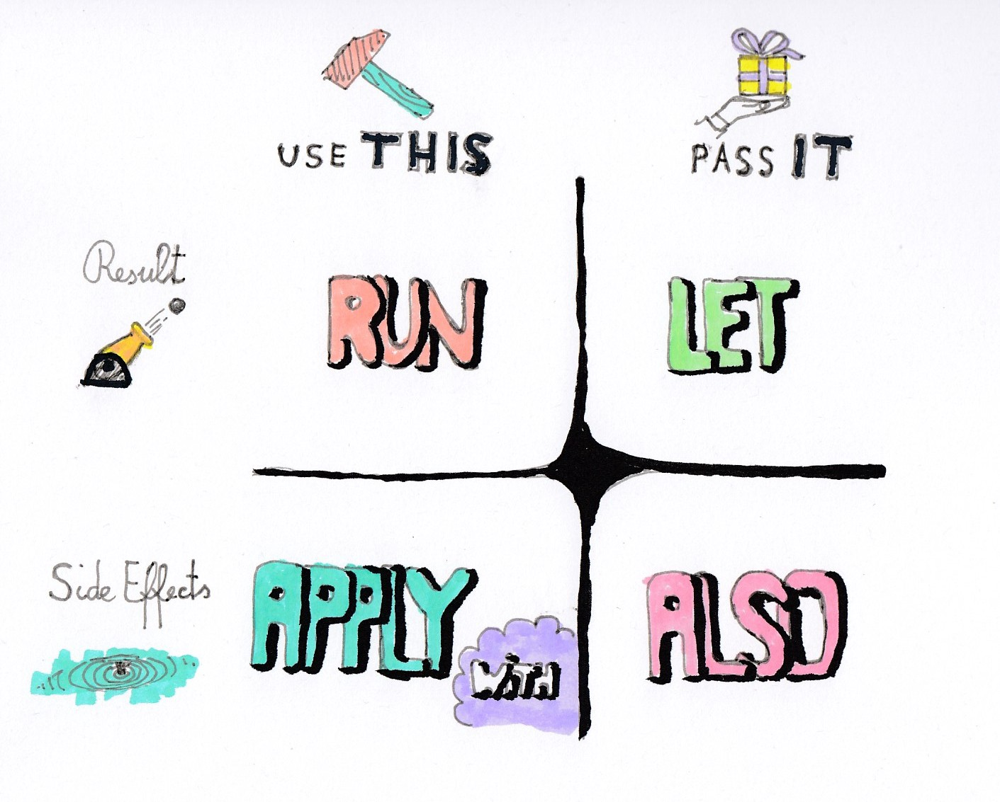

# 코틀린 라이브러리

> 코틀린의 다양한 라이브러리와 Scope Functions 을 학습한다.

## 코틀린 라이브러리

### 콜렉션 만들기

- arrayOf() : 배열 생성
- listOf() : 리스트 생성
- arrayListOf() : ArrayList 생성
- mutableListOf() : 값 변형 가능한 MustableList 생성
- setOf() : 중복없는 집합 Set 생성
- hashSetOf() : HashSet 생성
- mapOf() : key-value 형태의 Map 생성
- hashMapOf() : HashMap 생성
- to : Pair 생성 (1 to "one")

### Scope Function

- apply
- also
- let
- run
- with

### 기본 함수

- require() : 조건이 안맞으면 `IllegalArgumentException` 발생
- takeIf() : 조건이 맞으면 해당 변수를 가져오고 아니라면 `null` 반환
- repeat() : n번 반복한다

### String 관련 함수들

- toInt() : Int 정수로 변환 
- substring() : 부분 문자열 떼오기 
- startsWith() : 특정 문자열로 시작하는지 
- split() : 문자열을 특정 조건(정규식)으로 쪼갠다
- replace() : 특정 조건(정규식)에 해당하는 문자열을 바꾼다.

### 콜렉션 함수

- filter() : 해당 조건에 맞는 원소들로만 이루어진 List 반환
- all() : 모든 원소가 해당 조건이면 true, 하나라도 아니라면 false
- any() : 원소 중 하나라도 해당 조건을 충족하면 true, 아무것도 충족하지 못하면 false
- contains() : 특정 원소가 있는지 찾는다.
- map() : 특정 변환 조건에 따라 List를 다른 List로 변환
- sorted() : 기본적인 정렬 규칙으로 오른차순 정렬된 List 반환
- sortedBy() : 내가 원하는 조건으로 정렬
- associate(), associateBy() : Map으로 변환
- take() : 앞에서부터 n개의 원소 추출
- takeLast() : 뒤에서부터 n개의 원소 추출

# 숙제

- 문자열을 3,6,9 규칙에 따라 n번째 문자를 "짝"으로 바꿔서 출력하는 함수를 작성하시오

> 예제 입력 : Hello World and Kotlin!
> 예제 출력 : He짝lo짝Wo짝ld 짝nd짝Ko짝lin짝

- 문자열 안에 "#"이 있다면 각 짝수 1자리 제곱의 합을, 없다면 각 홀수 1자리 제곱의 합을 출력하는 함수를 작성하시오

> 예제 입력 : 2Ks3zj214_06ka#
> 예제 출력 : 60

> 예제 입력 : 2Ksz3j214_06ka!
> 예제 출력 : 10